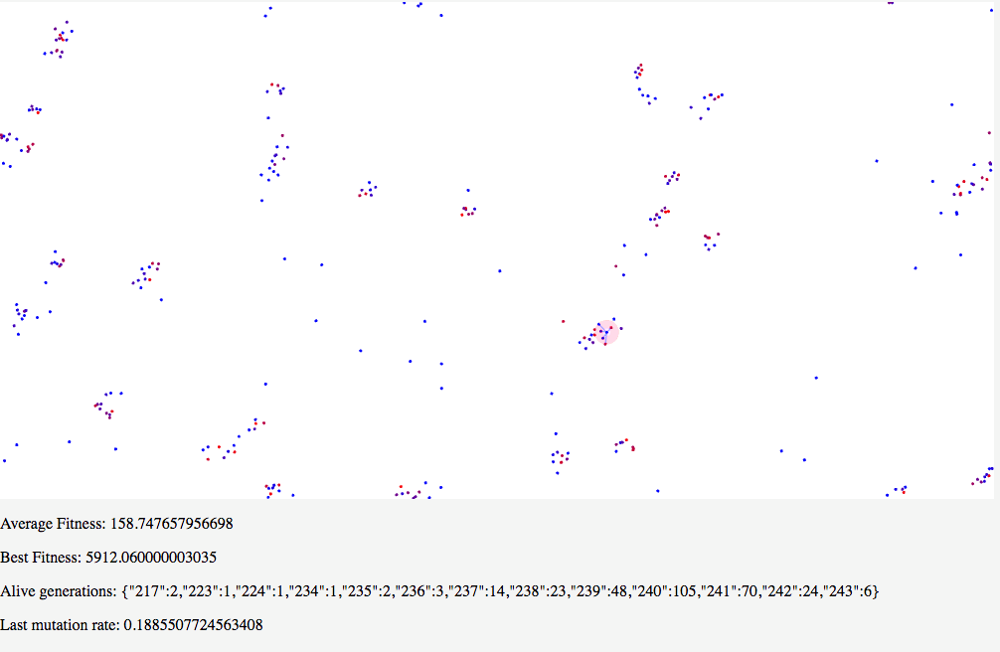

# swarm_simulator_js
2D bird swarm simulator using WebGL

## Description
This is a simulation of bird swarm behaviour using a dynamic variation of NEAT algorithm. 
The code relies on neatnaptic.js.

We use a variation of neural evolution with augmented topology (NEAT). Each agent is controlled by a single neural network. The agent takes in relative velocities and positions of nearby agents to feed in to the network and computes acceleration.
In out algorithm, there is no notion of generation in our algorithm. 
We kill and create an new agent dynamically based on real time value of agent fitnesses.
This has a benefit of encouraging the dynamic behaviour of the agents. At the same time, it s able to continue simulation wihout waiting for the fittest agent resulting in more parallelism. 

Agents have three penalty values. 
- Distance between its neighbours should not be too far or too close.
- Speed should not be too low with under very low acceleration value.
- Velocity should not stay constant.

These three penalties encourage agents to move in complex behaviour while getting clustered together.

## Pictures

## Demo
jamesparker.ml/swarm

## All tweakable parameters are in src/config.js.
If you find any interesting configuration, you can report it under issues.